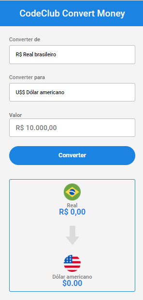
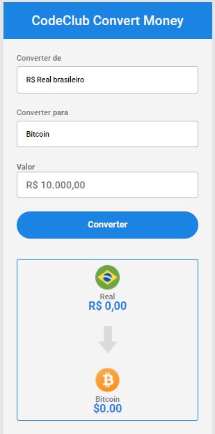

# Conversor de Moeda

<h2>Linguagens usadas: </h2>
<li>JavaScript: EventListener, GetElement, InnerHTML, CS6
<li>HTML: Select, Input, Button, Divs,
<li>CSS

<h3>Totalmente Funcional !!</h3>
 
Moedas usadas:
<li> Dólar Americano.
<li> Euro
<li> Bitcoin

<h4>Dev Club.</h4>

